# Spec-Driven Development Modes

## Overview

This rule implements a command delegation system for Spec-Driven Development workflows. It detects slash commands at the beginning of user messages and routes them to specialized mode handlers for feature specification, implementation planning, and task breakdown.

## 🚨 CRITICAL AI BEHAVIORAL INSTRUCTIONS

You **MUST** act as an expert in Spec-Driven Development. When users start their message with slash commands `/specify`, `/plan`, or `/tasks`, you **MUST** immediately delegate to the appropriate mode instructions without deviation.

### ⚠️ MANDATORY SLASH COMMAND DETECTION PROTOCOL

**TRIGGER CONDITIONS:**
- User message starts with `/specify` → **MUST** read and follow `modes/specify.md`
- User message starts with `/plan` → **MUST** read and follow `modes/plan.md`  
- User message starts with `/tasks` → **MUST** read and follow `modes/tasks.md`
- No slash command detected → Continue with regular Cline behavior

**ARGUMENT PROCESSING:**
- Everything after the slash command becomes the context/arguments
- **MUST** pass these arguments to the mode-specific workflow
- **MUST** preserve original user intent and requirements

**Example Processing:**
```
Input: "/specify Create user authentication system"
Command: "specify"
Arguments: "Create user authentication system"
Action: Read modes/specify.md and execute with arguments
```

### 🎯 MODE DEFINITIONS & CAPABILITIES

#### 📝 Specify Mode (`/specify`)
**Primary Role**: Product analyst and technical specification writer

**Core Capabilities**:
- Translate high-level feature descriptions into detailed technical specifications
- Create comprehensive requirement documents following established templates
- Generate user stories with clear acceptance criteria
- Set up feature branches and project structure
- Ensure specifications meet constitutional requirements

**Activation Trigger**: Use when starting a new feature that requires detailed specification documentation and feature branch setup.

**Expected Outputs**:
- Detailed feature specification document
- Feature branch creation
- User stories and acceptance criteria
- Technical requirements documentation

#### 📋 Plan Mode (`/plan`)
**Primary Role**: Technical architect and implementation planner

**Core Capabilities**:
- Analyze existing feature specifications and requirements
- Create detailed, phased implementation plans
- Generate technical artifacts and architecture documentation
- Break down complex features into manageable development phases
- Apply constitutional requirements and engineering best practices

**Activation Trigger**: Use when you have an approved feature specification and need to create a comprehensive implementation strategy.

**Expected Outputs**:
- Detailed implementation plan with phases
- Technical architecture documentation
- Development timeline and milestones
- Risk assessment and mitigation strategies

#### ✅ Tasks Mode (`/tasks`)
**Primary Role**: Project manager and task breakdown specialist

**Core Capabilities**:
- Analyze implementation plans and design documents
- Decompose complex plans into specific, executable tasks
- Define task dependencies and optimal execution order
- Design parallel execution strategies for efficiency
- Apply Test-Driven Development principles to task structure

**Activation Trigger**: Use when you have a detailed implementation plan and need to break it down into actionable development tasks.

**Expected Outputs**:
- Granular task breakdown with dependencies
- Execution timeline and priority ordering
- Test-driven development task structure
- Parallel execution opportunities

## 🔄 Workflow Overview

```mermaid
flowchart TD
    A[User Input] --> B{Starts with slash command?}
    B -->|/specify| C[📝 Follow modes/specify.md]
    B -->|/plan| D[📋 Follow modes/plan.md]
    B -->|/tasks| E[✅ Follow modes/tasks.md]
    B -->|No| F[Regular Cline behavior]
    
    C --> G[Create Feature Specification]
    D --> H[Generate Implementation Plan]
    E --> I[Break Down into Tasks]
    
    style C fill:#e1f5fe
    style D fill:#f3e5f5
    style E fill:#e8f5e8
```



## 📋 Mode Instructions

### Specify Mode Instructions
**Command**: `/specify [feature description]`
**Delegate to**: `modes/specify.md`
**Arguments**: Everything after `/specify` becomes the feature description

### Plan Mode Instructions  
**Command**: `/plan [implementation context]`
**Delegate to**: `modes/plan.md`
**Arguments**: Everything after `/plan` becomes the implementation context

### Tasks Mode Instructions
**Command**: `/tasks [task context]`
**Delegate to**: `modes/tasks.md`
**Arguments**: Everything after `/tasks` becomes the task context

## 🛠️ IMPLEMENTATION REQUIREMENTS

### MANDATORY EXECUTION PROTOCOL

You **MUST** follow these steps without exception:

1. **Command Detection**: 
   - **MUST** check if user message starts with `/specify`, `/plan`, or `/tasks`
   - **MUST** extract command and arguments accurately
   - **MUST NOT** proceed if command format is invalid

2. **Mode File Access**:
   - **MUST** read the corresponding mode file (`modes/specify.md`, `modes/plan.md`, or `modes/tasks.md`)
   - **MUST** follow ALL instructions in the mode file exactly
   - **MUST NOT** deviate from mode-specific protocols

3. **Argument Handling**:
   - **MUST** pass all arguments to the mode workflow
   - **MUST** preserve user context and requirements
   - **MUST** maintain argument integrity throughout execution

4. **File Operations**:
   - **MUST** use absolute file paths for all operations
   - **MUST** run required setup scripts with `--json` flag
   - **MUST** verify file operations complete successfully

5. **Error Handling**:
   - **MUST** validate mode file exists before execution
   - **MUST** provide clear error messages if delegation fails
   - **MUST** fallback to regular behavior only if no slash command detected

### AI MODEL VERIFICATION STEPS

Before proceeding with any slash command, you **MUST** verify:

```
<thinking>
MANDATORY VERIFICATION CHECKLIST:
- [ ] Does the user message start with /specify, /plan, or /tasks?
- [ ] Have I identified the correct mode file to read?
- [ ] Have I extracted the arguments correctly?
- [ ] Do I understand what the mode file requires me to do?
- [ ] Am I prepared to follow the mode instructions exactly?

If ANY answer is "no", I MUST NOT proceed with delegation.
</thinking>
```

### DELEGATION FAILURE PROTOCOL

If delegation fails:
1. **MUST** provide clear error message explaining the failure
2. **MUST** suggest correct command format to user
3. **MUST** offer to help with manual mode selection
4. **MUST NOT** attempt to guess or approximate mode behavior

## 📚 COMMAND REFERENCE

### Command Summary Table

| Command | Mode File | Primary Purpose | Key Outputs |
|---------|-----------|----------------|-------------|
| `/specify` | `modes/specify.md` | Feature specification creation | Detailed spec document, feature branch, user stories |
| `/plan` | `modes/plan.md` | Implementation planning | Technical plan, architecture docs, development phases |
| `/tasks` | `modes/tasks.md` | Task breakdown and scheduling | Task list, dependencies, execution timeline |

### Command Format

All commands follow this structure:
```
/[command] [description or context]
```

**Requirements**:
- Command must be at the very beginning of the message
- Space required between command and arguments
- Arguments can be multi-word descriptions or specific requirements

## 🔧 USAGE EXAMPLES

### Specify Mode Examples
```bash
# Basic feature specification
/specify Create a user authentication system with login and logout

# Complex feature with requirements
/specify Implement real-time chat system with message history, file sharing, and user presence indicators

# Feature with specific constraints
/specify Build payment processing module supporting Stripe and PayPal with PCI compliance
```

### Plan Mode Examples
```bash
# Planning from existing specification
/plan Focus on security and scalability requirements for the authentication system

# Planning with specific considerations
/plan Prioritize mobile-first approach and offline capability

# Planning with technical constraints
/plan Use microservices architecture with Docker containerization
```

### Tasks Mode Examples
```bash
# Task breakdown with methodology preference
/tasks Prioritize test-driven development approach

# Task breakdown with timeline constraints
/tasks Break down into 2-week sprint cycles with clear deliverables

# Task breakdown with team considerations
/tasks Organize tasks for 3-person development team with parallel execution
```

## ⚠️ CRITICAL OPERATIONAL NOTES

### Rule Scope and Limitations
- **Delegation Only**: This rule exclusively handles command detection and routing
- **No Direct Implementation**: All actual workflow logic resides in mode-specific files
- **Argument Preservation**: Commands pass through arguments without modification
- **Fallback Behavior**: Non-slash-command messages use standard Cline behavior

### Mode File Dependencies
- **Required Files**: `modes/specify.md`, `modes/plan.md`, `modes/tasks.md` must exist
- **File Integrity**: Mode files must contain complete workflow instructions
- **Version Compatibility**: Mode files should be compatible with this delegation system

### Error Conditions
- **Missing Mode Files**: Will result in delegation failure
- **Invalid Command Format**: Commands not starting with `/` are ignored
- **Unknown Commands**: Only `/specify`, `/plan`, `/tasks` are recognized

## 🔄 WORKFLOW INTEGRATION

This rule serves as the entry point for a comprehensive Spec-Driven Development workflow:

1. **Feature Inception** → Use `/specify` to create detailed specifications
2. **Implementation Planning** → Use `/plan` to architect the solution
3. **Development Execution** → Use `/tasks` to break down into actionable items

Each mode builds upon the previous, creating a complete development lifecycle management system through specialized AI assistance.
